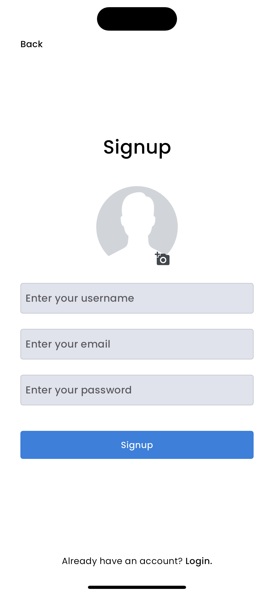
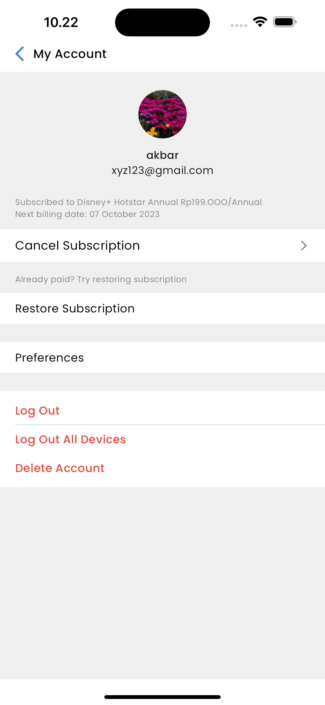

# Flutter Anime List App

This is a Flutter app that displays a list of anime loaded from the Kalaun API and integrated with Firebase.

## Feature

- Retrieve anime data from Kalaun API
- Displays a list of anime
- User authentication with Firebase
- Responsive design for Android and iOS

## Screenshot

### Home Screens
| Light Home Screen | Dark Home Screen |
|:-----------------:|:----------------:|
|  |  |

### Additional Screens
| Sidenav | Login Screen | Signup Screen | Profile Screen |
|:-------:|:------------:|:-------------:|:--------------:|
|  |  |  |  |

## Start

### Requirements

- Flutter installed on your development machine. You can follow [Official Flutter installation guide](https://flutter.dev/docs/get-started/install) for instructions.
- Firebase project set up. You can create a new project in [Firebase Console](https://console.firebase.google.com/).

### Installation

1. Clone this repository:

   ```sh
   git clone https://github.com/akbarekaputra01/animelist_flutter.git
   cd animelist_flutter
   ```

2. Install dependencies:

   ```sh
   flutter pub get
   ```

3. Set up Firebase:

   - Open Firebase Console, select your project.
   - Add the Android/iOS app to your Firebase project and follow the instructions to download `google-services.json` (for Android) or `GoogleService-Info.plist` (for iOS).
   - Place the `google-services.json` file in the `android/app` directory.
   - Place the `GoogleService-Info.plist` file in the `ios/Runner` directory.
   - Follow additional setup instructions provided by Firebase to integrate with Flutter.

4. Configure Firebase in your Flutter app:

   - Make sure the dependencies are added to your `pubspec.yaml` file.

5. Run the application:
   ```sh
   flutter run
   ```

## Usage

1. Launch the app on your device or emulator.
2. Register or log in using your email and password.
3. Browse the list of anime taken from the Kalaun API.

## API

This application uses [Jikan API](https://jikan.moe/) to retrieve anime data. Be sure to check out their documentation for more details.

## Firebase

This app uses Firebase for user authentication and Firestore for storing data. Make sure to set up Firebase properly by following the installation steps above.

## Contribute

If you would like to contribute to this project, please fork the repository and create a pull request with your changes.
